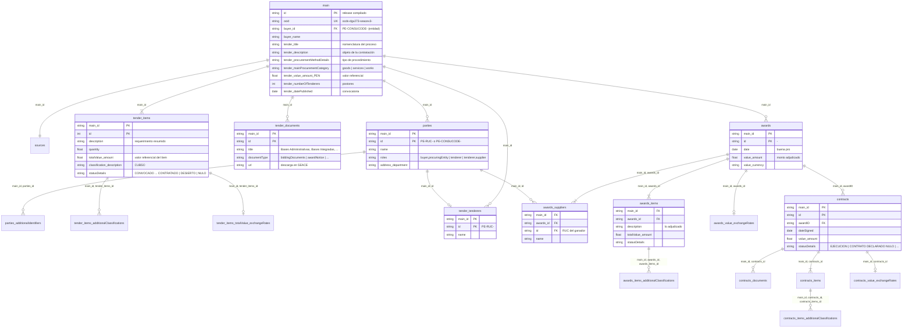
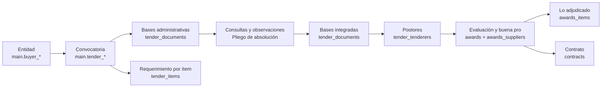

# Esquema de los datos OCDS del SEACE

Los 21 CSV son la versión "aplanada" del estándar OCDS (Open Contracting Data Standard) que publica el Estado peruano a partir del SEACE. Cada fila de `main.csv` es un **compiled release**: el estado más reciente de un proceso de contratación, identificado por su `ocid`. Todas las demás tablas cuelgan de él mediante `main_id`.

> **Regla práctica.** Los ids de `awards`, `contracts`, ítems y documentos **no son únicos globalmente**: la clave real siempre incluye `main_id`. Unir, por ejemplo, `awards_suppliers.awards_id = awards.id` sin `main_id` mezcla procesos distintos.

La integridad de este esquema se comprueba con código (`python src/perfil_datos.py` → `results/perfil_datos.md`): todas las claves primarias compuestas son únicas y todas las claves foráneas cubren el 100 % de las filas, salvo `contracts.awardID → awards.id` (94,2 %) y `awards_suppliers.id → parties.id` (99,8 %).

## Diagrama entidad-relación

## Del modelo OCDS al negocio de las contrataciones

| Pregunta de negocio | Dónde está | Cómo se obtiene |
|---|---|---|
| ¿Qué entidad compra? | `main.buyer_id/buyer_name` = `parties` con rol `buyer,procuringEntity` | 2 968 entidades distintas |
| ¿Qué se compra y por cuánto? | `main.tender_description`, `tender_items` (descripción, cantidad, CUBSO, valor referencial por ítem) | 1,24 ítems por proceso en promedio |
| ¿Cuáles son las bases / TDR? | `tender_documents`: *Bases Administrativas* (99,99 % de los procesos), *Bases Integradas* (61 %), *Pliego de absolución de consultas y observaciones* (42 %), *Resumen ejecutivo* | Solo la **URL** del PDF/ZIP; el texto no está en los CSV |
| ¿Cuáles son los requisitos? | Dentro del PDF de las bases (capítulo del requerimiento: especificaciones técnicas o términos de referencia, y requisitos de calificación) | En los CSV solo existe su resumen: `tender_items.description` |
| ¿Quiénes compitieron? | `tender_tenderers` (RUC y razón social) | ~10 postores por proceso en promedio; mediana 6 |
| ¿Quién ganó? | `awards` (buena pro) + `awards_suppliers` (RUC del ganador) | El ganador figura entre los postores en el 99,75 % de los casos |
| ¿Qué ofreció el ganador? | `awards_items` (descripción, cantidad y monto adjudicado) y `awards.value_amount` | Las ofertas de los perdedores **no** se publican |
| ¿Se firmó contrato? | `contracts` (+ `contracts_documents` con el PDF del contrato) | 95 082 contratos; `awardID` enlaza con la buena pro |

### Ciclo de un proceso visto en las tablas

## Cifras clave (de `results/perfil_datos.json`)

- 122 556 procesos (compiled releases) de 2 968 entidades; convocatorias de nov-2013 a sep-2026 (70 458 en 2025-2026).
- 51 147 procesos de bienes, 54 972 de servicios y 16 437 de obras.
- 638 350 documentos de convocatoria; 1 220 176 registros de postores (169 725 proveedores distintos); 104 608 adjudicaciones (57 630 ganadores distintos); 95 082 contratos.
- El 17 % de los procesos con dato tuvo **un solo postor**; entre los adjudicados es el 18 %, con fuerte variación por procedimiento: 88 % en Contratación Directa, 44 % en Adjudicación de Menor Cuantía y menos de 3 % en Licitación Pública Abreviada y Concurso Público Abreviado.

## Limitaciones de los datos para el tema de investigación

1. **El texto de los requisitos no está en los CSV.** Las bases están en PDF, Word o comprimidos (52 % de los documentos son zip o rar) y se enlazan por URL. Por eso la PC1 trabaja con `tender_items.description`, que es el resumen del requerimiento publicado por la entidad. Leer las bases completas (extracción de texto, fragmentación, RAG) corresponde a fases posteriores.
2. **`tender_tenderers` es a nivel de proceso, no de ítem.** En procesos con varios ítems no se sabe a qué ítem se presentó cada postor.
3. **`awards_items` no guarda el id del ítem convocado.** En `src/construir_casos.py` se enlaza por descripción dentro del mismo proceso.
4. **Montos en varias monedas.** Hay adjudicaciones en USD (por ejemplo, el caso C10 del BCRP); `main.tender_value_amount_PEN` ya viene convertido, pero `awards.value_amount` no.
